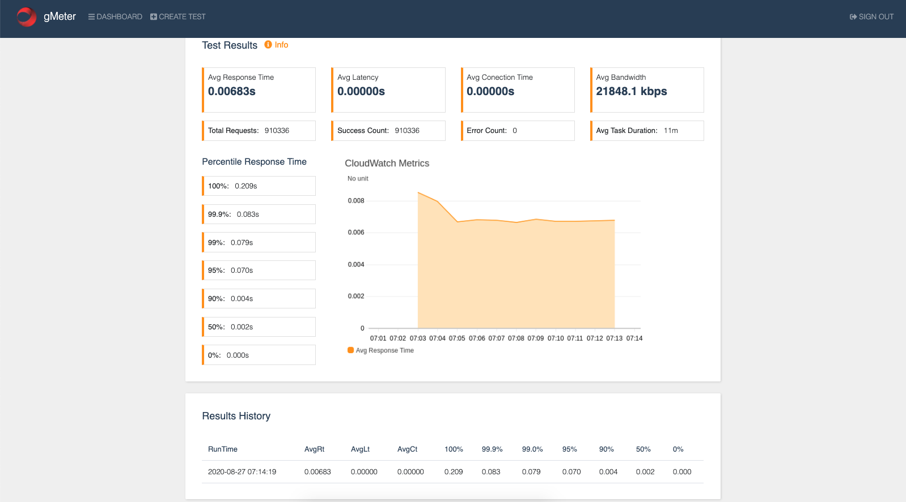

# AWS-gMeter
### Distributed gRPC Load Test on AWS

The project is inspired by AWS Distributed Load Testing https://aws.amazon.com/solutions/implementations/distributed-load-testing-on-aws/

### Architecture

### Screenshots

